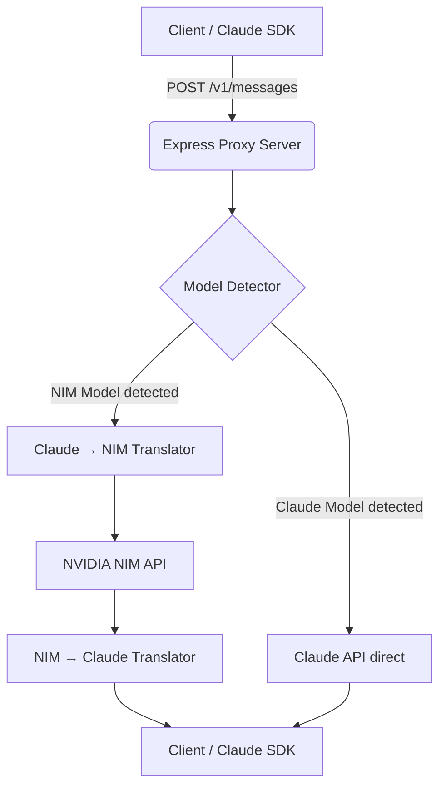

<div align="center">

# 🤖 Claude ↔ NVIDIA NIM Proxy

[](https://www.typescriptlang.org/)
[](https://nodejs.org/)
[](https://build.nvidia.com)
[](https://www.docker.com/)
[](https://opensource.org/licenses/MIT)

A bidirectional proxy server that translates between the **Claude API** and **NVIDIA NIM API**. 
Use your existing Claude SDK code (like *Claude Code CLI*) effortlessly with NVIDIA NIM's powerful and cost-effective models!

[Features](#-features) • [Quick Start](#-quick-start) • [Claude Code CLI Guide](#%EF%B8%8F-using-with-claude-code-cli) • [Supported Models](#-supported-models) • [Architecture](#-architecture)

</div>

---

## ✨ Features

- 🎭 **Single Endpoint**: `POST /v1/messages` natively accepts Claude-format requests.
- 🔀 **Smart Routing**: Automatically detects your model and routes appropriately:
  - `claude-*` models → **Claude API**
  - `vendor/*` models (e.g., `meta/llama-*`) → **NVIDIA NIM API**
- 🔄 **Transparent Translation**: Handles model formats automatically.
  - Converts request elements (system prompts, params) gracefully.
  - Normalizes responses back to the expected Claude format perfectly.
- 🌊 **Streaming Support**: SSE streaming for zero-latency, real-time responses.
- 🛡️ **Production Ready**: Full Docker support, robust error handling, and health checks.

---

## 🚀 Quick Start

### Prerequisites
- Node.js 18+ or Docker
- [NVIDIA NIM API key](https://build.nvidia.com/)
- *Optional:* Anthropic Claude API key

### 1. Installation

```bash
git clone https://github.com/yourusername/claude-nim-proxy.git
cd claude-nim-proxy
npm install
```

### 2. Configuration

Copy the example environment file and add your keys:

```bash
cp .env.example .env
```

Update `.env` with:
```env
NVIDIA_NIM_API_KEY=nvapi-your-key-here
ANTHROPIC_API_KEY=sk-ant-your-key-here # (Optional if only using NIM)
PORT=3000
NODE_ENV=development
```

### 3. Start the Server

```bash
npm run dev
# ✨ Server running on http://localhost:3000
```

---

## 💻 Usage with Claude SDK

It's plug-and-play. Just point your Anthropic SDK to your local proxy!

```javascript
import Anthropic from "@anthropic-ai/sdk";

const client = new Anthropic({
  apiKey: "proxy-key", // The proxy handles the real keys
  baseURL: "http://localhost:3000",
});

// Run a NIM model through the Claude SDK!
const message = await client.messages.create({
  model: "meta/llama-3.1-70b-instruct",
  max_tokens: 1024,
  messages: [{ role: "user", content: "Explain quantum computing in one sentence." }],
});

console.log(message.content);
```

---

## 🛠️ Using with Claude Code CLI 

**(No Anthropic Subscription Required!)**

This project includes easy launchers to use the official [Claude Code CLI](https://docs.anthropic.com/en/docs/agents-and-tools/claude-code/overview) powered purely by NVIDIA NIM.

### Windows (PowerShell)
With the proxy server running, open a new terminal:
```powershell
.\launch-claude-nim.ps1 -Model "meta/llama-3.1-70b-instruct"
```

### Windows (CMD)
```cmd
launch-claude-nim.bat
```

### Manual Command
```bash
export ANTHROPIC_API_BASE_URL="http://localhost:3000"
export ANTHROPIC_API_KEY="dummy"
claude --bare --model "meta/llama-3.1-70b-instruct"
```

---

## 🤖 Supported Models

You can natively use any Claude models or switch seamlessly to NVIDIA NIM ones:

| Model Type | Examples |
|------------|----------|
| **NVIDIA (Meta)** | `meta/llama-3.1-8b-instruct`, `meta/llama-3.1-70b-instruct` |
| **NVIDIA (Mistral)** | `mistralai/mistral-7b-instruct`, `mistralai/mixtral-8x7b-instruct` |
| **NVIDIA (Google)** | `google/gemma-7b`, `google/gemma-2-2b-it` |
| **NVIDIA (Others)** | `moonshotai/kimi-k2.6` |
| **Anthropic** | `claude-3-5-sonnet-20241022`, `claude-opus-4-7` |

*Browse the [NVIDIA NIM catalog](https://catalog.ngc.nvidia.com/orgs/nvidia/teams/ai-foundation/models) for more.*

---

## 🐳 Docker Deployment

Deploying the proxy is as simple as launching a container:

```bash
docker build -t claude-nim-proxy .

docker run -p 3000:3000 \
  -e NVIDIA_NIM_API_KEY=nvapi-your-key-here \
  -e ANTHROPIC_API_KEY=sk-ant-your-key-here \
  claude-nim-proxy
```

---

## 🏗 Architecture

How the translation works under the hood for NIM models:

<details>
<summary>Click to view request flow</summary>


</details>

### Key Translation Differences Handled

| Aspect | Claude Format | NVIDIA NIM Format | Proxy Action |
|--------|--------------|-------------------|--------------|
| **System Prompt** | `system: "..."` parameter | First message `{role: "system"}` | Native conversion |
| **Temperature** | Defaults to `1.0` | Defaults to `0.2` | Preserves & maps bounds |
| **Response** | `{content, usage, ...}` | `{choices, usage, ...}` | Formats perfectly mapping |
| **Finish Reason**| `end_turn` | `stop` | Accurate state translation |

---

## 🐛 Troubleshooting

* **401 Unauthorized**: Double-check your API keys in the `.env` file and restart the API server.
* **Model Not Found**: Ensure you are using the precise string identifier natively provided by NVIDIA NIM endpoints.
* **Streaming Issues**: Try verifying functionality by turning `stream: false` in your client body.

<br>

<div align="center">
  <b>Built for flexible and cost-effective AI development.</b><br>
  Released under the <a href="LICENSE">MIT License</a>.
</div>
